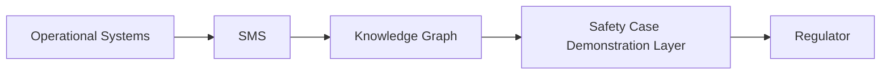

# TP Risk Management SMS → Safety Knowledge Graph + AI Risk Intelligence Platform
**Status: DRAFT — architecture proposal only. No implementation code has been written. Per your instructions, coding does not start until this is approved.**

Analysis basis: the live site (`https://leeshegog-jpg.github.io/TP_Risk_Management_SMS/`), the GitHub repo (`leeshegog-jpg/TP_Risk_Management_SMS`), and your local clone at `D:\Github\TP_Risk_Management_SMS` (which is 16 commits behind `origin/main`, has uncommitted edits to several HTML/CSS/JS files, and has untracked local-only additions — full text of the **WHS Act 2011**, **WHS Regulation 2011**, and **ISO 31000:2018** already converted to Markdown, plus three renamed/newer HTML tools not yet pushed. None of this was touched — noted here only because it changes what's "reusable"). This document does not modify any existing file.

---

## 1. Phase 1 — What V1 Actually Is

V1 is **not** a single `index.html`. It's a ~20-module client-side suite, entirely static HTML/CSS/vanilla JS (one page uses React via CDN), with `localStorage` as the only datastore and an optional Windows-only PowerShell+Claude agent pipeline bolted on the side. It already encodes a large amount of VRTP-specific (Village Roadshow Theme Parks) safety framework logic — this is a major asset, not a blank slate.

### 1.1 Module inventory

| Page | Role | Tech | Persistence |
|---|---|---|---|
| `index.html` | Hub — nav, live stats, backup/restore, Obsidian sync settings | HTML/JS | reads `sms-shared.js` |
| `risk-register.html` | Risk Register (5×5 matrix) | HTML/JS | `localStorage: sms_risks` |
| `incident-report.html` | Incident/near-miss log, notifiable-incident flags, links to local agent pipeline | HTML/JS | `localStorage: sms_incidents` |
| `corrective-actions.html` | CAR register | HTML/JS | `localStorage: sms_cars` |
| `audit-inspection.html` | Audit/inspection register | HTML/JS | `localStorage: sms_audits` |
| `safety-dashboard.html` | SPI charts, pulls from all 4 stores | HTML/JS | reads all |
| `risk-report-generator.html` | Consolidated Word/Excel export | HTML/JS | reads all |
| `flowchart.html` | SFARP decision flowchart (static reference) | HTML | none |
| `GOHS4.1.8.X_FARSI_Control_Effectiveness_Calculator_v0.2.html` | Control effectiveness scoring (**FARSI**) | HTML/JS | none (CSV export only) |
| `bowtie-ccm-generator.html` | AI hazard/bow-tie/critical-control generator, 108-row pilot register | HTML/JS | in-memory + optional push to `sms_risks` |
| `vrtp-ohs-tools/Figtree_Risk_Entry_Review.html` | AI-assisted QA of risk entries against VRTP standards | HTML/JS | — (not fully inspected) |
| `briefing-viewer.html` | Renders `CRITICAL_RISK_MANAGEMENT_BRIEFING.md` | HTML/JS | — |
| `injury-claims-dashboard.html` | Injury/claims analytics | HTML/JS | — (not fully inspected) |
| `url-parser.html` + `.js` | Generic Excel/CSV URL parser | HTML/JS | unrelated utility, not SMS content |
| `OHS_Command_Centre/*` | A **second, parallel** tabbed launcher embedding a **different** React hazard register, a duplicate incident/dashboard pair | React (CDN) + HTML/JS | `localStorage: gohs__*` keys + IndexedDB |
| `local-automation/*` | Windows PowerShell HTTP server + two Claude-Sonnet agents (Investigation Agent → Compliance Agent → Safety Case Trigger check) | PowerShell + Anthropic API | writes to an Obsidian vault (Markdown files) |
| `obsidian-sync.js` | Optional push of every saved record to an Obsidian REST API as a formatted note | JS | external (Obsidian vault) |
| `CRITICAL_RISK_MANAGEMENT_BRIEFING.md` | Generic (non-VRTP-specific) critical-risk-management reference: ICMM CCM framework, hazard/risk/control definitions, maturity model, 12-phase implementation roadmap | Markdown | — |

Local-only, uncommitted: `WHS Act 2011.md`, `WHS Reg 2011.md`, `ISO 31000 -2018 Risk management - Guidelines.md` (full legislative/standard text already in Markdown — valuable for the AI extraction engine and for RAG), plus `critical-risk-briefing.html`, `figtree-risk-entry-review.html`, `hazard-register-builder.html` (renamed/evolved versions of files above — not yet reconciled with what's live).

### 1.2 Terminology & framework already encoded in V1 (must be preserved, not reinvented)

- **VRTP Risk Matrix (GOHS2.1.2)** — 5×5, Likelihood {Rare, Unlikely, Possible, Likely, Almost Certain} × Consequence {Insignificant, Minor, Moderate, Serious, Critical}, bands Extreme 15–25 / High 10–14 / Medium 5–9 / Low 1–4.
- **3-gate Control/Support/Verification test (GOHS-REF-SMS-001)** — Gate 1 physical/presence, Gate 2 direct-removal test, Gate 3 specifiable/measurable. All three pass → `Control`; any fail → follow-up question routes to `Support` or `Verification`.
- **Critical Control Test** — applied only to items that pass all 3 gates: sits directly in front of a fatality/catastrophic consequence with no other reliable barrier behind it.
- **SFARP gate** — on the current-risk step, if band is Extreme/High, blocks a justification that just asserts "risk is acceptable" (regex-enforced today).
- **608B flag** — WHS Regulation prescribed-incident flag for major-amusement-park events, captured at both the bow-tie consequence level and the incident-report level (`osrNotified`, referencing Chapter 9A).
- **FARSI control-effectiveness scoring (GOHS4.1.8.X, draft, parent GOHS4.1.8 v7)** — Functionality, Availability, Reliability, Survivability, **Interaction** (confirmed authoritative — see §8). Each 1–5, averaged, banded into an effectiveness multiplier (High 100% / Moderate 60% / Low 30% / Very Low 10%), combined with a per-hierarchy-level cap (Elimination 100% → PPE 20%), a residual-likelihood floor, and an independence check to avoid double-counting non-independent controls.
- **Control hierarchy** — Elimination → Substitution → Isolation → Engineering → Administrative → PPE (Safe Work Australia hierarchy, matches the briefing doc).
- Governing document references cited throughout the code: `GOHS2.1.2`, `GOHS2.1.38`, `OHS-PRO-003`, `GOHS-REF-SMS-001`, `GOHS-GN-HAZID-001`, `GOHS4.1.8` v7, plus `AS 3533.2`, `ISO 17842-1:2023`/`ISO 17842-3`, `WHS Reg 2011 (Qld) s 608B(2)`.

### 1.3 Existing AI/automation assets (genuinely reusable logic, not throwaway)

1. **`local-automation/`** — a working Investigation Agent → Compliance Agent → Safety Case Trigger pipeline, already invoking Claude via the Anthropic API, already reasoning about s 608R/Chapter 9A triggers. This is your Phase 7/9 AI extraction + gap-analysis engine, already prototyped — it just needs porting from a Windows-only PowerShell HTTP listener into the FastAPI service, and its API key needs to move server-side (see §4).
2. **`bowtie-ccm-generator.html`'s "Import AI Draft (JSON)"** — a defined JSON schema for an AI-drafted hazard (threats/consequences/controls/gates/effectiveness), already validated against `validateDraft()` business rules. This is close to the target extraction schema for the Document AI Intelligence Engine and should seed it directly.
3. **`OHS_Command_Centre/hazard_register.html`'s** direct-to-`api.anthropic.com` calls from the browser demonstrate the prompt pattern already used for hazard generation for specific rides/assets — reusable as a prompt template, **not** as an architecture (see finding below).

### 1.4 Findings — problems in V1 to fix, not port forward

1. **No single hazard/risk data model.** Four incompatible schemas coexist: the `sms-shared.js` Risk entity (17 fields, simple matrix), the `bowtie-ccm-generator.html` 55-column flat CSV schema (VRTP's richest, most complete model — bow-tie + 3-gate + critical control + SFARP), the `OHS_Command_Centre` React register (10 fixed categories, different field names entirely), and the FARSI calculator (its own control-effectiveness fields, exports to CSV only, no shared ID). They don't share record IDs, and none of them share a **controlled vocabulary** either — each invented its own category strings independently. This is the single biggest thing the new platform must fix, and it's two problems, not one: a schema problem (§5) and a vocabulary problem (§3).
2. **No real persistence.** Everything is `localStorage` (or IndexedDB for folder handles) — single browser, single device, no audit trail, no concurrent users, trivially lost. The Obsidian sync is the closest thing to a durable evidence store today, and it's optional/manual.
3. **Client-side exposed API key.** `OHS_Command_Centre/hazard_register.html` stores an Anthropic API key in `localStorage` (`gohs__apikey`) and calls the API directly from the browser. This must not carry forward — all LLM calls move behind the FastAPI backend.
4. **Cross-references are free text, not foreign keys.** `carRefs`, `sourceRef`, `SMS Risk ID`, etc. are comma-separated strings matched by convention, not enforced relationships. Real traceability (your core requirement) is impossible on this model as-is.
5. **GitHub Pages cannot host the target stack.** Resolved — Azure (§8).
6. **Hazard vs Risk vs Control conflation.** The briefing doc defines these rigorously (§3.1–3.7 of that document) but no code enforces the distinction — e.g. `risk-register.html`'s "Category" field (Physical/Chemical/Biological/...) is actually a *hazard* taxonomy bolted onto a *risk* record. The new entity model fixes this (§5).
7. **No controlled vocabulary anywhere.** Every V1 tool free-texts its own category/type strings independently, with no synonym handling ("LOTO" vs "Lockout" vs "Isolation" would today be three unrelated strings) and no way to validate AI-extracted terms against a known concept set. This is what §3 exists to fix, and it needs to exist *before* large-scale AI ingestion starts, not after.

---

## 2. Proposed Application Architecture

**Layering correction (added after your review against the WHSQ Guide — full detail: [docs/knowledge-graph/11-safety-case-demonstration-model.md](knowledge-graph/11-safety-case-demonstration-model.md)):** the SMS and the Safety Case are not the same output of this platform. Confirmed directly from the Guide (§7.1, quoted): *"it is also important to distinguish between the safety case and the SMS. The safety case is descriptive of how 'you', the operator, manages the risks of ADIs. The SMS is the documentation of policy, procedures, operational management tools and governance... The SMS reduces risk SFAIRP."* The architecture below reflects that as an explicit extra layer, not a merged pipeline:

```mermaid
flowchart TB
    subgraph Client["Frontend — React + TypeScript + Tailwind + shadcn/ui"]
        Dash[Executive Dashboard]
        SMS_UI[SMS Module Views]
        HazLib[Hazard Knowledge Library]
        MHR[Major Hazard Register]
        RiskEng[Risk Management Engine]
        CCM[Critical Control Management]
        DocAI[Document Upload / AI Review UI]
        Graph[Knowledge Graph Explorer — Cytoscape.js]
        BowtieUI[Bow-Tie / MoC Diagrams — React Flow]
        GapUI[AI Gap Analysis]
        SafetyCase[Safety Case Workspace]
        DemoUI[Safety Case Demonstration Engine]
        OntoUI[Ontology Curator UI]
    end

    subgraph API["Backend — FastAPI"]
        REST[REST/GraphQL API]
        AuthZ[AuthN/AuthZ]
        Ingest[Document Ingest Service]
        Extract[AI Extraction Service — LlamaIndex]
        GraphSvc[Graph Sync Service]
        GapSvc[Gap Analysis Service]
        OntoSvc[Ontology Service]
        DemoSvc[Demonstration Generation Service]
    end

    subgraph Data["Data Layer"]
        PG[(PostgreSQL — system of record)]
        Neo[(Neo4j — knowledge graph + ontology graph)]
        Qdrant[(Qdrant — vector search)]
        Blob[(Object storage — source documents, evidence files)]
    end

    subgraph AIStack["Document Intelligence"]
        Unstructured[Unstructured / Apache Tika — parsing]
        Tesseract[Tesseract — OCR]
        LLM[Claude via Anthropic API — extraction + agents]
    end

    Client --> REST
    REST --> PG
    REST --> Neo
    OntoUI --> OntoSvc --> Neo
    OntoSvc --> PG
    Ingest --> Unstructured --> Tesseract
    Ingest --> Blob
    Extract --> LLM
    Extract --> OntoSvc
    Extract --> PG
    GraphSvc --> Neo
    GraphSvc --> PG
    Qdrant <--> Extract
    GapSvc --> Neo
    GapSvc --> PG
    DemoSvc --> Neo
    DemoSvc --> LLM
    DemoUI --> DemoSvc
```

**Why this shape, given what V1 already does:**
- `sms-shared.js`'s CRUD/stats functions become FastAPI endpoints over Postgres — same conceptual model (risks/incidents/cars/audits), just server-side and multi-user.
- `local-automation`'s two-agent pipeline becomes the `Extract`/`GapSvc` services — same agents, same Claude calls, now behind auth instead of a bare localhost listener, and now **constrained by the ontology** instead of free-texting categories.
- **New:** the Demonstration Generation Service is what turns Knowledge Graph facts into the regulator's actual unit of assessment — a demonstrated argument, not a queryable database. Nothing in V1 does this; it's the platform's answer to "you built an excellent knowledge graph, but that's not the regulator's end goal" — full model in [docs/knowledge-graph/11-safety-case-demonstration-model.md](knowledge-graph/11-safety-case-demonstration-model.md).
- Cytoscape/React Flow are additive — nothing in V1 does graph visualization today; the bow-tie generator is form/table-based, not a diagram. The same Cytoscape explorer serves both the instance graph (hazards/controls/evidence) and the ontology graph (taxonomies) — one viewer, two graphs.
- Neo4j is new — V1 has no graph, only flat rows with string cross-refs. This is the actual foundation for "show me every critical risk, the controls preventing it, verification, evidence, gaps" — that query is not answerable on the current flat-file model at all.

---

## 3. Safety Ontology (Foundational Layer)

Built **before** large-scale AI ingestion, not after — added per your recommendation, and correctly so: every downstream component (Postgres FK constraints, Neo4j node labels, LlamaIndex extraction prompts, gap-analysis rules) is far more expensive to retrofit onto a controlled vocabulary than to build against one from the start. V1's evidence for this: four tools independently invented four incompatible category lists because nothing forced them to share one.

### 3.1 Model — SKOS-style controlled vocabulary

Represented as a **Simple Knowledge Organization System (SKOS)**-pattern graph — the standard, proven shape for exactly this problem (concepts, hierarchy, synonyms, cross-scheme relations), not a bespoke invention:

| Concept | Fields | Purpose |
|---|---|---|
| **OntologyScheme** | id, name, description, version | One per taxonomy: Hazard, Energy Source, Asset, Control, Failure Mode, Consequence, Verification, Evidence, Regulatory, Relationship-Type Registry |
| **Concept** | id, scheme_id, pref_label, definition, parent_concept_id (broader), status (draft/approved/deprecated), source_ref, effective_from, effective_to | One node per taxonomy term (e.g. "Crushing" under "Moving Machinery" under "Mechanical Energy") |
| **ConceptAlias** | concept_id, alias_text, alias_type (synonym / abbreviation / deprecated_term) | "LOTO" / "Lockout" / "Isolation" → all alias to one `Concept` |
| **ConceptRelation** | subject_concept_id, relation_type (broader/narrower/related/equivalent), object_concept_id | Cross-scheme links, e.g. a Control concept `related_to` a Regulatory concept |
| **RelationshipTypeRegistry** | id, name (e.g. `MITIGATED_BY`, `VERIFIED_BY`), domain_scheme, range_scheme, description | Governs the graph's own edge types as vocabulary, not ad-hoc strings scattered through code |
| **ExtractionRule** | id, target_concept_id, pattern_type (regex / embedding-similarity / LLM-prompt-instruction), confidence_threshold, action (auto-accept / flag-for-review / reject), example_positive, example_negative | Drives the AI Extraction Service — every extracted term is matched against this before it becomes a record |

**Where it lives:** natively in **Neo4j** as first-class concept nodes (`Concept -[BROADER]-> Concept`, `Concept -[HAS_ALIAS]-> Alias`) — Neo4j is the natural home for a taxonomy graph, and it means the Ontology Curator UI and the Knowledge Graph Explorer are the same Cytoscape component pointed at two different graphs. **Postgres** holds a synced, read-optimized copy (`ontology_concepts`, `ontology_aliases`) for form autocomplete, FK constraints on instance tables, and fast validation — not a second source of truth, a materialized view kept in sync by the Ontology Service.

### 3.2 Sub-taxonomies — seed from V1 where it exists, flag where it doesn't

| Sub-taxonomy | Seed source in V1 | Status |
|---|---|---|
| Control taxonomy | `REF.controlHierarchy` (Elimination→PPE) in `bowtie-ccm-generator.html` | Reuse directly — already canonical |
| Consequence taxonomy | `REF.consequenceDomains` (Health & Safety, Environmental, Food Safety, Psychosocial) | Reuse directly |
| Energy source taxonomy | `REF.identificationMethods` "Energy Analysis" list (kinetic, potential, electrical, thermal, chemical, pressure, radiation, biological, acoustic, ergonomic) | Good starting seed |
| Verification taxonomy | `FREQ_DAYS` enum (Daily→Biennial) + free-text verification methods | Frequency half exists; method vocabulary needs formalizing |
| Asset taxonomy | `park`/`device` fields, `SOURCE_LIBRARY` catalogue (Movie World, Wet'n'Wild, General/All Parks) | Partial — not a real hierarchy yet |
| Hazard taxonomy | Your spec's example tree (Mechanical Energy → Moving Machinery → Crushing) | **Net-new** — aspirational, not in V1; needs VRTP HSE input to build for real, not inferable from code |
| Failure mode taxonomy | — | **Net-new**, not present anywhere in V1 |
| Evidence taxonomy | Sketched only as an entity (§5 `Evidence.type`) | **Net-new** |
| Regulatory ontology | WHS Act/Reg/ISO 31000 already in Markdown locally | WHS Act/Reg buildable now; **ISO 45001/AS 3533/ISO 17842 clause-level text is not present locally — mark `TO BE CONFIRMED` until sourced**, do not fabricate clause numbers |
| Synonyms/aliases | Not captured anywhere in V1 | **Net-new**, first real deliverable of this layer |

### 3.3 Governance

Concepts move `draft → reviewed → approved → published`, versioned (`effective_from`/`effective_to`), so historical hazard records stay valid as the vocabulary evolves — an SMS in daily use cannot have old records silently invalidated by a taxonomy edit. Needs a named curator (VRTP HSE role, not a developer) — same governance pattern the briefing doc recommends for its document suite, applied to the vocabulary itself.

### 3.4 How this changes the rest of the architecture

- **Postgres schema (§5):** every category/type/hierarchy field on every entity becomes a foreign key to `ontology_concepts`, not a free-text column or hardcoded enum.
- **AI Extraction Service:** prompts are built by pulling the *current* concept + alias list per scheme at call time, not hardcoded in the prompt string — and every extraction result is checked against `ExtractionRule.confidence_threshold` before auto-accepting. Starting thresholds should be treated as defaults to calibrate against real extraction runs, not fixed numbers guessed today.
- **Gap Analysis Service:** duplicate-hazard and inconsistent-requirement detection (your spec's item 9) becomes an ontology query — two hazards mapping to the same `Concept` with different free text are the duplicate signal, which is not detectable at all on V1's data.

---

## 4. Migration Plan

| Phase | Goal | Primary V1 inputs | Key risk |
|---|---|---|---|
| **1 — Analysis** (this document) | Inventory, architecture, entity model, migration plan | Full repo | — |
| **2 — Scaffold** | React/TS/Tailwind/shadcn app shell, FastAPI skeleton, Azure resources, CI | `styles.css`/`sms.css` design tokens (reuse, don't redesign) | Scope creep — build shell only, no business logic yet |
| **3 — Safety Ontology** | Build the SKOS-pattern scheme in Neo4j + synced Postgres tables, seed sub-taxonomies per §3.2, stand up the Ontology Curator UI | `REF.controlHierarchy`, `REF.consequenceDomains`, `REF.identificationMethods`, `FREQ_DAYS` | Hazard/asset/failure-mode/evidence taxonomies are net-new content — needs VRTP HSE input, not inferable from code; don't let this phase stall waiting for a "complete" taxonomy, publish v1 and version it |
| **4 — Data models** | Postgres schema + SQLAlchemy models per §5, Neo4j instance-graph schema, all category fields FK'd to ontology concepts | Entity model in §5 | Reconciling 4 divergent V1 schemas into 1 — needs field-mapping scripts, not manual re-entry |
| **5 — Migrate SMS content** | Port Risk/Incident/CAR/Audit modules with real CRUD, migrate the 108-row pilot register + any real localStorage data currently sitting in your browser | `sms-shared.js`, all 4 register pages, `bowtie-ccm-generator` seed data | **Export your live `localStorage` data (Backup All Data on the Hub) before this phase** — it's not in any file, only in your browser |
| **6 — Hazard knowledge graph** | Neo4j instance-graph population, Cytoscape explorer | `bowtie-ccm-generator` REF object, ontology from Phase 3 | Depends on Phase 3 being seeded first |
| **7 — AI document intelligence** | Port `local-automation` agents into FastAPI services, wire Unstructured/Tesseract/LlamaIndex, move API key server-side, extraction constrained by ontology `ExtractionRule`s | `local-automation/*`, `bowtie-ccm-generator`'s AI-draft JSON schema, `hazard_register.html`'s prompt patterns | Must not re-expose the API key client-side (V1's React register did this — do not repeat) |
| **8 — Risk intelligence** | Gap analysis service, control-assurance-gap detection, ontology-driven duplicate detection | `GOHS4.1.8.X` FARSI logic, briefing doc §11 "common mistakes" as gap-detection heuristics | — |
| **9 — Safety Case assurance** | SafetyCaseClaim workspace, full traceability UI | Briefing doc §3.10–3.12, local-automation's Safety Case Trigger check | Needs legal/compliance sign-off on claim wording — flag, don't auto-generate assurance language |

---

## 5. Data / Entity Model

Canonical entities (Postgres = system of record for structured data; Neo4j holds the same entities as a graph for traversal — synced, not duplicated as a separate source of truth). Every `category`/`type`/`hierarchy`-style field below is a **foreign key into the Ontology (§3)**, not a free-text string or local enum.

| Entity | Key fields | Derived from V1 |
|---|---|---|
| **Asset** | id, name, park, type → *Asset taxonomy*, ISO 55000 class *(TO BE CONFIRMED)* | `device`/`park` fields (React register), `rideAsset` (incident-report) |
| **Hazard** | id, name, category → *Hazard taxonomy*, energy_source → *Energy Source taxonomy*, description, exposure_pathway, possible_consequence, date_identified, owner | `bowtie-ccm-generator` hazard fields + briefing hazard/risk definitions; **not** `risk-register.html`'s "Category" field, reclassified as hazard taxonomy |
| **Risk** | id, hazard_id, description, cause, inherent_likelihood, inherent_consequence, inherent_rating, current_likelihood, current_consequence, current_rating, target_likelihood, target_consequence, sfarp_justification, status, review_date | `sms-shared.js` Risk + `bowtie-ccm-generator` inherent/current/target fields merged |
| **Consequence** | id, risk_id, description, domain → *Consequence taxonomy*, severity, flag_608B | `REF.consequenceDomains`, `Consequence_Description`, `608B Prescribed Incident` |
| **Control** | id, risk_id, description, type (Prevention/Mitigation), hierarchy → *Control taxonomy*, owner, classification (Control/Support/Verification — 3-gate result), gate_1/2/3, effectiveness_rating | `bowtie-ccm-generator` control object |
| **CriticalControl** | control_id (1:1 with Control where critical=true), performance_standard_id, verification_method → *Verification taxonomy*, verification_frequency, verification_owner, evidence_required, farsi_functionality, farsi_availability, farsi_reliability, farsi_survivability, farsi_interaction | Critical Control Test + FARSI calculator fields — first time these two V1 tools share a data model |
| **PerformanceStandard** | id, critical_control_id, requirement_text, measurable_criteria | `Control Performance Requirement` field |
| **VerificationActivity** | id, critical_control_id, method → *Verification taxonomy*, frequency, due_date, last_completed, performed_by, result, evidence_id | `Verification*` fields across bow-tie generator + FARSI calc |
| **Evidence** | id, type → *Evidence taxonomy*, source_document_id, uploaded_by, uploaded_at, linked_entity_type, linked_entity_id | New formal entity — today "evidence" is just a free-text `Verification Record Location` string |
| **FailureMode** | id, control_id, description, mode → *Failure Mode taxonomy* | New — required by your Major Hazard Register spec, not present in V1 |
| **Document** | id, filename, mime_type, uploaded_at, extraction_status, source_hash | New — backs the AI Document Intelligence Engine |
| **Incident** | id, datetime, type, severity, vrtp_severity, location, asset_id, description, immediate_cause, root_cause, whsq_notified, osr_notified, investigation_status, linked_risk_ids | `incident-report.html` (already the most complete entity in V1 — port near-verbatim) |
| **Investigation** | id, incident_id, method (ICAM etc. — *TO BE CONFIRMED which methodology VRTP mandates*), findings, contributing_factors, corrective_actions | `local-automation` Investigation Agent output structure |
| **Action** (Corrective Action) | id, source_type, source_id, description, root_cause_category, priority, assigned_to, due_date, status, effectiveness_review | `corrective-actions.html` — port near-verbatim |
| **AuditFinding** | id, audit_id, severity, description, linked_action_id | `audit-inspection.html` — port near-verbatim |
| **Requirement** | id, source → *Regulatory ontology* (WHS Act/Reg/ISO 45001/ISO 31000/AS 3533/Chapter 9A), clause_ref, text, applies_to_entity_type | New — seeded from the WHS Act/Reg/ISO 31000 `.md` files already in your local clone; ISO 45001/AS 3533 clauses `TO BE CONFIRMED` |
| **SafetyCaseClaim** | id, hazard_id or critical_control_id, claim_text, evidence_ids[], regulatory_ref_ids[], assurance_status | New — realizes Hazard→Requirement→Control→Evidence→Verification→Argument chain |

**Relationships (the graph):** `Asset -[HAS_HAZARD]-> Hazard -[GIVES_RISE_TO]-> Risk -[MITIGATED_BY]-> Control -[CLASSIFIED_AS_CRITICAL]-> CriticalControl -[GOVERNED_BY]-> PerformanceStandard -[VERIFIED_BY]-> VerificationActivity -[PRODUCES]-> Evidence -[SUPPORTS]-> SafetyCaseClaim -[TRACES_TO]-> Requirement`. `Incident -[REVEALS]-> Hazard`, `Incident -[TRIGGERS]-> Action`, `AuditFinding -[TRIGGERS]-> Action`, `Action -[REMEDIATES]-> Control`. Every edge type here is itself a governed `RelationshipTypeRegistry` entry from §3, not an ad-hoc string.

This is exactly what makes "what controls protect against uncontrolled movement across all rides?" and "show every gap between critical control and evidence" answerable as graph queries instead of manual cross-referencing.

---

## 6. Reusable Content — keep / port-logic / rebuild

| V1 asset | Disposition |
|---|---|
| VRTP Risk Matrix, band thresholds, L/C labels | **Keep as-is** — encode directly in the new Risk entity |
| 3-gate Control/Support/Verification test + Critical Control Test | **Port logic verbatim** into the Control classification service |
| FARSI scoring model | **Port logic** into `CriticalControl` service |
| SFARP gate regex/validation | **Port logic**, tighten (regex-only detection is weak — flag for review, not a blocker) |
| `sms-shared.js` stats functions | **Port logic** into a dashboard aggregation endpoint |
| `styles.css`/`sms.css` tokens | **Reuse** as starting Tailwind theme, don't redesign colors from scratch |
| `CRITICAL_RISK_MANAGEMENT_BRIEFING.md`, WHS Act/Reg/ISO 31000 `.md` files | **Reuse directly** as seed corpus for `Requirement` entity + vector store |
| `bowtie-ccm-generator.html` 108-row pilot register | **Migrate as real data** — this is your only existing sample dataset with real content |
| `local-automation` agent pipeline | **Port logic**, change transport from PowerShell/localhost to FastAPI |
| Obsidian sync | **Rebuild as optional export**, not core persistence — Postgres is now the system of record |
| `OHS_Command_Centre` React register + its client-side Anthropic calls | **Discard the architecture, salvage the prompts** — do not port the client-side API key pattern |
| `url-parser.html`/`.js` | **Not SMS content** — leave out of migration scope unless you want it kept as a standalone utility |
| `injury-claims-dashboard.html`, `Figtree_Risk_Entry_Review.html` | Not fully inspected yet — flag for a follow-up read before Phase 5/7 so nothing in them is lost |

---

## 7. Gaps Against Your 10-Module Spec

Modules with **no V1 equivalent at all** (net-new build, not migration): Executive Dashboard (a real one — `safety-dashboard.html` is single-module, not cross-cutting assurance/readiness), Major Hazard Register as a distinct entity from the general Risk Register, Safety Knowledge Graph (Neo4j/Cytoscape), the Safety Ontology itself (§3), AI Gap Analysis (as an automated service — V1's Figtree review tool is a manual QA aid, not automated gap detection), Safety Case Management workspace, Requirement entity / ISO 45001 clause mapping (your spec requires every SMS section link to an ISO 45001 clause + WHS requirement + evidence source — **none of this mapping exists in V1 today**; it needs to be authored, and clause numbers will not be fabricated — marked `TO BE CONFIRMED` until sourced from the actual standard text).

Modules with a **strong V1 foundation** to build on: Risk Management Engine, Critical Control Management (register + FARSI, needs unifying), Document AI Intelligence (local-automation pipeline), SMS structural sections (policy/governance/etc. — check `index.html` nav and briefing doc for existing section boundaries, not yet fully mapped to ISO 45001 clauses).

---

## 8. Decisions (confirmed)

1. **Hosting: Azure.** Backend runs in Azure, not locally, not GitHub Pages. Target services (final selection happens in Phase 2 using Azure's own current best-practice guidance, not guessed here):
   - **Compute:** Azure Container Apps for FastAPI + the extraction/gap-analysis workers (matches the async, scale-to-zero-friendly nature of document processing jobs; Functions is an alternative for the ingest trigger specifically).
   - **PostgreSQL:** Azure Database for PostgreSQL — Flexible Server.
   - **Neo4j:** no native Azure PaaS offering — either Neo4j AuraDB (managed, cross-cloud) or self-hosted Neo4j on a Container App/AKS with persistent storage. Decide in Phase 2 based on budget.
   - **Qdrant:** Qdrant Cloud or self-hosted container, same trade-off as Neo4j.
   - **Object storage:** Azure Blob Storage for uploaded documents/evidence files.
   - **OCR/parsing (Tesseract, Unstructured, Apache Tika):** run as part of the Container Apps ingest worker; Azure AI Document Intelligence is a possible managed alternative to self-hosted Tesseract — worth evaluating in Phase 2 rather than assuming self-hosted OCR is final.
2. **FARSI definition: V1's is authoritative.** Functionality, Availability, Reliability, Survivability, **Interaction**. The entity model in §5 reflects this.
3. **Migration strategy: strangler-fig.** The live GitHub Pages site keeps running unchanged throughout. New Azure-hosted modules go live one at a time; each module's nav link on `index.html` gets repointed to the new Azure-hosted version once that module has full parity + a real data migration from `localStorage`. Suggested cutover order, richest/highest-value V1 modules first: **Risk Register → Incident Report → Critical Control Management (bow-tie generator + FARSI calc unified) → Corrective Actions/Audits → Dashboard → Hazard Knowledge Graph/Safety Case (net-new, no V1 equivalent to strangle)**. GitHub Pages becomes a thin shell that either redirects or iframes into Azure once a module cuts over — mirrors what `OHS_Command_Centre`'s tabbed-iframe launcher already does, so the pattern isn't new to this codebase.
4. **Live browser data.** Before Phase 5 migrates any module, export real operational data via the Hub's "Backup All Data" button on any machine that has been using the live site — it exists only in that browser's `localStorage`, not in any file.
5. **Safety Ontology is a foundational component (§3),** built in Phase 3 — before Data Models (Phase 4) and well before AI ingestion (Phase 7) — not bolted on under the knowledge-graph phase as originally scoped.

When Phase 2 scaffolding actually begins, Azure deployment code will be generated using Azure's own current best-practices tooling rather than from general knowledge, so specific resource SKUs/configuration may refine beyond what's listed above.

---

## 9. Foundation Artefacts (Phase 1 complete — controlled design documents)

The remaining Phase 1 deliverables — Enterprise Knowledge Graph Specification, Neo4j model, PostgreSQL schema, AI Extraction Specification, Knowledge Provenance Model, Relationship Rules Catalogue, Inference Rules Catalogue, Critical Control Assurance Model, Regulatory Knowledge Model, and OpenAPI 3.1 contract — are in [docs/knowledge-graph/](knowledge-graph/README.md). Each requires approval before any implementation, same as this document. No application code has been written.
