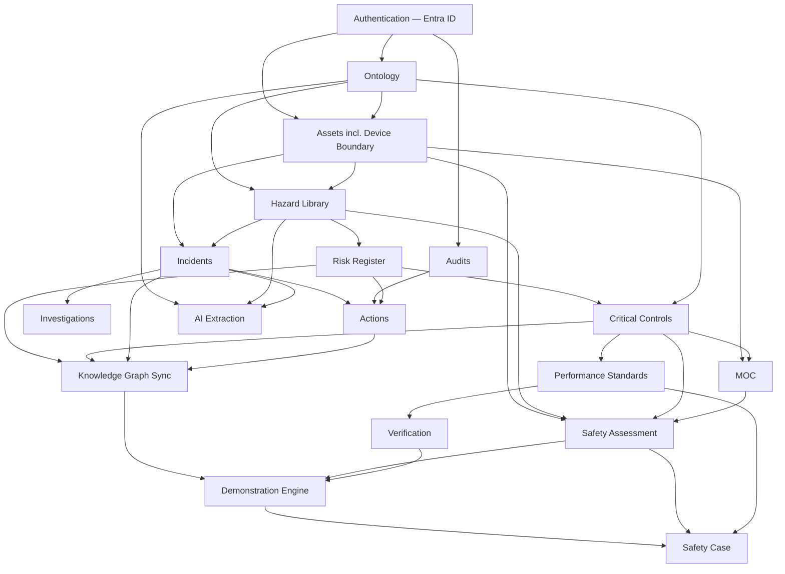

# 03 — Module Dependency Map
**Status: DRAFT — Phase 2.1 Implementation Blueprint. Baseline: Design Baseline v1.0 (frozen).**
**Traceability:** module boundaries derive directly from [knowledge-graph/02](../knowledge-graph/02-neo4j-node-relationship-model.md) entity groupings and [knowledge-graph/06](../knowledge-graph/06-relationship-rules-catalogue.md) relationship dependencies — not newly invented groupings.

---

## 1. Dependency Diagram

## 2. Module Table

| Module | Prerequisite modules | Dependent modules | Primary interfaces | API boundary (OpenAPI tag) |
|---|---|---|---|---|
| **Authentication** | — | All others | Entra ID OIDC/OAuth2 | `securitySchemes.bearerAuth` |
| **Ontology** | Authentication | Assets, Hazard Library, Critical Controls, AI Extraction, all modules with classification fields | `ontology.concepts`/`ontology.schemes` (Postgres), ontology graph (Neo4j) | `Ontology` tag |
| **Assets** (incl. Device Boundary — [11](../knowledge-graph/11-safety-case-demonstration-model.md) §2) | Authentication, Ontology | Hazard Library, Incidents, MOC, Safety Assessment | `safety.assets`, `safety.device_boundaries`, `safety.interfaces` | `Assets` tag |
| **Hazard Library** | Ontology, Assets | Risk Register, Incidents, AI Extraction, Safety Assessment | `safety.hazards` | `Hazards` tag |
| **Risk Register** | Hazard Library | Critical Controls, Actions, Knowledge Graph | `safety.risks`, `safety.consequences` | `Risks` tag |
| **Critical Controls** (3-gate, EIA, FARSI — [08](../knowledge-graph/08-critical-control-assurance-model.md)) | Risk Register, Ontology | Performance Standards, MOC, Safety Assessment, Knowledge Graph | `safety.controls`, `safety.critical_controls`, `safety.failure_modes` | `Controls`, `CriticalControls` tags |
| **Performance Standards** | Critical Controls | Verification, Safety Case | `safety.performance_standards` | (under `CriticalControls` tag) |
| **Verification** | Performance Standards | Demonstration Engine, Monitoring | `safety.verification_activities`, `safety.evidence`, `safety.monitoring_summaries` | `Verification`, `Evidence` tags |
| **Incidents** | Assets, Hazard Library | Investigations, Actions, AI Extraction, Knowledge Graph | `safety.incidents`, `safety.incident_hazards` | `Incidents` tag |
| **Investigations** | Incidents | — | `safety.investigations` | (under `Incidents` tag) |
| **Audits** | Authentication | Actions | `safety.audits`, `safety.audit_findings` | `Audits` tag |
| **Actions** | Incidents, Audits, Risk Register | Knowledge Graph | `safety.actions`, `safety.action_controls` | `Actions` tag |
| **MOC** ([11](../knowledge-graph/11-safety-case-demonstration-model.md) §7.2a) | Assets, Critical Controls | Safety Assessment | `safety.management_of_change`, `safety.review_triggers` | `SafetyCase` tag (`/management-of-change`) |
| **AI Extraction** ([04](../knowledge-graph/04-ai-extraction-specification.md)) | Ontology, Hazard Library, Incidents | Writes into Hazard Library/Risk Register/Critical Controls/Investigations as drafts | `safety.documents`, extraction run/draft endpoints | `Documents`, `Extraction` tags |
| **Knowledge Graph Sync** | Risk Register, Critical Controls, Incidents, Actions | Demonstration Engine, Gap Analysis | Graph Sync Service (internal), `/graph/query/{patternId}` | `KnowledgeGraph` tag |
| **Safety Assessment** ([11](../knowledge-graph/11-safety-case-demonstration-model.md) §4) | Assets, Hazard Library, Critical Controls, MOC | Demonstration Engine, Safety Case | `safety.safety_assessments`, `safety.credible_events` | `SafetyCase` tag |
| **Demonstration Engine** ([11](../knowledge-graph/11-safety-case-demonstration-model.md) §7) | Knowledge Graph Sync, Safety Assessment, Verification | Safety Case | `safety.demonstrations`, `/demonstrations` | `SafetyCase` tag |
| **Safety Case** (Claims/Arguments/Evidence/Requirements) | Demonstration Engine, Safety Assessment, Performance Standards | — (terminal) | `safety.safety_case_claims`, `safety.safety_arguments`, `regulatory.requirements` | `SafetyCase`, `Requirements` tags |

## 3. Reading the Map for Sequencing

Note that Gap Analysis is not a separate implementation module — it is a read-only service layered over Knowledge Graph Sync ([knowledge-graph/07](../knowledge-graph/07-inference-rules-catalogue.md) rules run as scheduled/on-demand queries), so it has no independent position in this table; it becomes available incrementally as each rule's prerequisite entities exist. This map is the input to [04-implementation-roadmap.md](04-implementation-roadmap.md) — release boundaries are drawn along it, not across it, so no release ships a module whose prerequisites aren't already merged.
