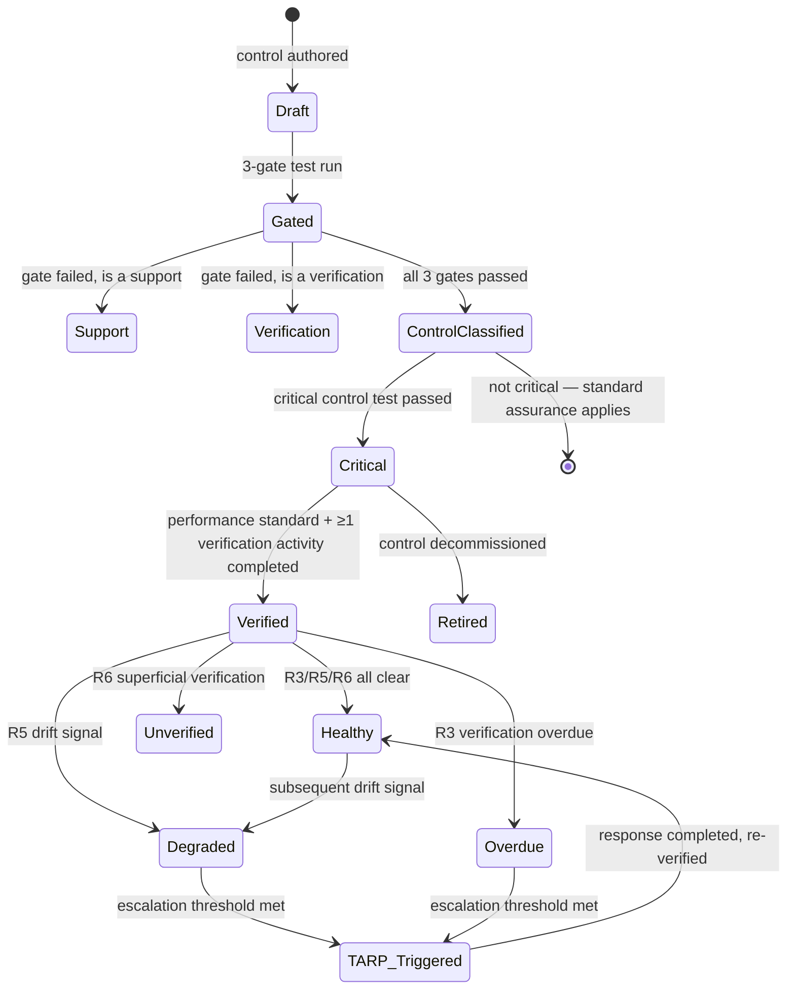

# Critical Control Assurance Model
**Status: DRAFT — controlled design document. Requires approval before implementation.**
**Parent:** [01-enterprise-knowledge-graph-specification.md](01-enterprise-knowledge-graph-specification.md)
**Depends on:** [03-postgresql-schema.sql](03-postgresql-schema.sql) `safety.controls`, `safety.critical_controls`, `safety.trigger_action_response_plans`; [07-inference-rules-catalogue.md](07-inference-rules-catalogue.md) R2/R3/R5/R6/R8
**Verified against:** *Guide for major amusement parks: Preparing a safety case* (WHSQ, 2021) §9.2.2–9.2.2.2, Table 2, Table 3 — full text read directly (2026-08-03), not secondhand. See [11-safety-case-demonstration-model.md](11-safety-case-demonstration-model.md) §0.

---

## 1. Purpose

Formalizes how a `Control` becomes a `CriticalControl`, how its assurance is maintained over time, and how degradation is caught and escalated — the mechanism behind your platform objective's "how those controls are verified... where gaps remain." Every rule here is ported from V1 logic that already works (`bowtie-ccm-generator.html`'s 3-gate test) plus **two distinct control-effectiveness tools the Guide itself specifies** (§4) — these are not the same thing, and prior drafts of this document conflated them with V1's internal GOHS-REF-SMS-001 test. They are complementary, applied at different points in the workflow.

## 2. Stage 1 — The 3-Gate Control/Support/Verification Test

Ported verbatim from `bowtie-ccm-generator.html` (`GOHS-REF-SMS-001`). Applied to every candidate control at authoring time:

| Gate | Question | Fails to... |
|---|---|---|
| 1 — Physical/Presence | Is it a physical object, a human action, or both — present and acting at the moment the hazard releases? | A management plan on a server is not present when the event occurs |
| 2 — Direct removal test | Does it, of itself, directly prevent or mitigate the event? (Remove everything else — does this alone still act on the event?) | Operator training alone holds nobody — fails as a Control, may pass as a Support |
| 3 — Specifiable/measurable | Can its required performance be specified, measured, and verified? | If you can't write a performance standard, you can't know it works or detect its erosion |

All three pass → `classification = 'Control'`. Any fail → follow-up ("is this an in-field check confirming another control works?") routes to `'Verification'` if yes, else `'Support'`. `Support` and `Verification` items are retained in the graph (they matter — they keep controls functioning and confirm they're present) but are structurally barred from `CLASSIFIED_AS_CRITICAL` ([06-relationship-rules-catalogue.md](06-relationship-rules-catalogue.md) §3).

## 3. Stage 2 — The Critical Control Test

Applied only to items already classified `'Control'`: *"Does this control sit directly in front of a fatality/catastrophic consequence, with no other reliable barrier behind it? If it fails or is absent, is a fatality or critical event likely to result?"* Yes → `CriticalControl` row created (1:1, `control_id` PK). This matches the briefing doc's four-criteria definition (§3.7: consequence test, specificity, verifiability, independence) and explicitly excludes what the briefing doc calls out as **not** critical controls: a safety induction, a register entry, a generic procedure, a culture initiative.

## 4. Stage 3 — Control Effectiveness Assessment: Two Tools, Not One

**Correction from an earlier draft of this document:** V1's `bowtie-ccm-generator.html` 3-gate test (§2, `GOHS-REF-SMS-001`, VRTP-internal) answers *what kind of thing is this* (Control / Support / Verification). It is a **different question** from *how good is this control*, which is what the Guide's own §9.2.2–9.2.2.2 addresses with two named tools, confirmed by direct reading of the source document, not V1's paraphrase of it:

### 4a. The Effective / Independent / Auditable (EIA) test — quick assessment

Sourced by the Guide from Layer of Protection Analysis (LOPA) independent-protective-layer criteria (Guide Table 2). Described as "a simple first assessment" — qualitative, fast, usable in the field, applicable to any control including human/control-system interfaces:

| Criterion | Question | Guide's own example |
|---|---|---|
| **Effective** | Can the control detect the condition requiring it to act, and in time to act? | Effective: a SIL-rated safety trip that stops a roller coaster launch via zone detection. Less effective: an operator observing the first vehicle and manually not starting the second |
| **Independent** | Is the control independent of the hazard (initiating event) and of other identified controls — not susceptible to common-cause failure? | Independent: two zone-detection loops using different sensor types. Not independent: two identical zone detectors used for the same trip |
| **Auditable** | Can the control be tested by audit and validated as performing its designed function, with retained records? | Auditable: full-loop SIL trip testing on a maintenance schedule with retained records. Not auditable: third-party maintenance with no records provided |

A control meeting all three is "independent and effective." Failing any one makes it "only partially effective" — requiring additional controls for defence in depth, not a rejection of the control itself.

```sql
-- addendum to 03-postgresql-schema.sql
ALTER TABLE safety.controls ADD COLUMN eia_effective   boolean;
ALTER TABLE safety.controls ADD COLUMN eia_independent boolean;
ALTER TABLE safety.controls ADD COLUMN eia_auditable   boolean;
```

### 4b. FARSI — detailed assessment

Confirmed verbatim from the Guide (§9.2.2.1, Table 3, citing Energy Institute *Guidelines for management of safety critical elements*, 3rd ed. 2020): **F**unctionality, **A**vailability, **R**eliability, **S**urvivability, **Interdependency** — not "Interaction." V1's `GOHS4.1.8.X_FARSI_Control_Effectiveness_Calculator_v0.2.html` has this wrong (says "Interaction") — a defect in V1, not a correct source to have ported from. This corrects an earlier draft of this document set, which took V1's calculator as authoritative without checking it against the Guide directly; it should not have been. Every document/schema/API field in this repository has been updated to match the Guide (see revision note at the top of this document).

Guide's own worked example (Table 3) per FARSI dimension:
- **Functionality** — what the control must do (e.g. "the vehicle brakes must stop the device in the unloading zone")
- **Availability** — proportion of time the control must be capable of performing on demand (e.g. ride brakes: 100% required; a ride operator juggling 10 safety tasks in 2 minutes: ~16% actual)
- **Reliability** — probability of correct operation at any point in time / mean time before failure
- **Survivability** — whether the control survives the damaging event itself (e.g. brakes unaffected by the failure event = high survivability; an operator who may go into shock and not respond = low survivability)
- **Interdependency** — degree of reliance on other systems to perform its function (e.g. permanent-magnet brakes with no dependency vs. an operator relying on a detector triggering a light/alarm = high dependency)

Applied to every `CriticalControl`, this being the "more quantitative, machine-safety-orientated" tool the Guide recommends for engineering controls specifically (EIA above being the general-purpose quick check):

- `farsi_score` = average of the five (stored as a generated column, [03-postgresql-schema.sql](03-postgresql-schema.sql)).
- Banded into an effectiveness multiplier: High (≥4.0) 100%, Moderate (3.0–3.9) 60%, Low (2.0–2.9) 30%, Very Low (<2.0) 10%. **This banding scale and the hierarchy-cap/residual-floor mechanics below are V1's own addition (`GOHS4.1.8.X`, parent `GOHS4.1.8 v7`) — the Guide itself defines the five FARSI dimensions and gives a worked qualitative example (Table 3) but does not itself prescribe a numeric banding-to-multiplier formula. Retained as VRTP's internal quantification method, now clearly attributed as VRTP-internal rather than implied as the Guide's own formula.**
- Combined with a control-hierarchy cap (Elimination 100% → PPE 20%, control hierarchy required under WHS Regulation s.36) and a residual-likelihood floor (20% general, 10–15% for ADI/high-consequence hazards) — a control can never be scored as reducing risk below this floor, however high its FARSI score, because no single control is treated as eliminating residual risk entirely.
- Independence check: a chain of non-independent controls (e.g. two controls that share a common failure mode, like two systems on the same power circuit) cannot have their effectiveness multiplied together as if independent — matches the Guide's own EIA "Independent" criterion (§4a) applied at the chain level; full detail is [07-inference-rules-catalogue.md](07-inference-rules-catalogue.md) R2.

### 4c. Which to use when

Run EIA (§4a) first, on every candidate control, as the field-usable first pass the Guide itself recommends. Run FARSI (§4b) on every `CriticalControl` specifically (engineering controls especially) for the detailed quantified assessment that feeds risk-reduction calculations. A control that fails EIA's Independent or Auditable criteria should not be relied on as a critical control's sole FARSI-scored barrier — this is a new cross-check ([07-inference-rules-catalogue.md](07-inference-rules-catalogue.md) R17).

## 5. Stage 4 — Ongoing Assurance: The Three Lines of Defence

Realizes briefing doc §3.12 onto existing entities, now directly grounded in the Guide's own §11 "Governance, performance indicators and audit" (Schedule 18C(7) Performance monitoring, Schedule 18C(8) Audit) rather than only the generic ICMM briefing doc — no new entity needed beyond what V1's audit module already has:

| Line | Who | Mechanism | Entity |
|---|---|---|---|
| **First** | Control owner / operator, self-check | Scheduled `VerificationActivity` per the control's `PerformanceStandard` | `safety.verification_activities` |
| **Second** | Supervisor / manager / HSE | Periodic management review of verification records (Guide §11.1 "Standards and performance indicators", Schedule 18C(7)) | `safety.audits` where `audit_type = 'Management Review'` (already an enum value in V1's `audit-inspection.html` — reused, not invented) |
| **Third** | Independent auditor | Scheduled or triggered independent audit (Guide §11.2 "Auditing (performance monitoring)", Schedule 18C(8)) | `safety.audits` where `audit_type IN ('Internal Audit','External Audit','Regulatory Inspection')` |

A `CriticalControl`'s assurance status at any point in time is the newest completed activity across all three lines, with the **third line required at least once per [frequency — TO BE CONFIRMED against VRTP's actual audit cycle policy — the Guide requires the safety case to state "methods, frequency and results" of auditing (§11.2) but leaves the frequency itself to the operator]** before a linked `SafetyCaseClaim` can reach `assurance_status = 'approved'`.

### 5.1 Leading vs. Lagging Indicators (Guide §11.1, confirmed)

The Guide explicitly requires **both** indicator types, not either: *leading* indicators are predictive (detect erosion from expected performance before failure — the Guide's own example: rising breakdown-maintenance rate on one device), *lagging* indicators are historical record (the Guide's own example: successful rider-restraint lock tests — confirms the system worked, but gives no early warning). Added to `MonitoringSummary` ([11-safety-case-demonstration-model.md](11-safety-case-demonstration-model.md) §6):

```sql
ALTER TABLE safety.monitoring_summaries ADD COLUMN indicator_class varchar(10) CHECK (indicator_class IN ('leading','lagging'));
```

A `CriticalControl` relying only on lagging indicators (e.g. only completed-verification counts, no trend/precursor signal) is a gap finding — matches the Guide's own point that lagging indicators "will not give an early indication that a failure is imminent." New rule: [07-inference-rules-catalogue.md](07-inference-rules-catalogue.md) R18.

## 6. Control Health State Machine



`Healthy`/`Degraded`/`Overdue`/`Unverified` are not stored as an enum column — they are computed at query time from R3/R5/R6 outputs ([07-inference-rules-catalogue.md](07-inference-rules-catalogue.md)), so the state is always current, not a stale cached flag.

## 7. Trigger Action Response Plans (TARPs)

Net-new — briefing doc §5.7 describes TARPs narratively; V1 has no equivalent. Formalized as `safety.trigger_action_response_plans` ([03-postgresql-schema.sql](03-postgresql-schema.sql)): each `CriticalControl` can have multiple TARPs, one per distinct trigger condition, each citing the inference rule that fires it (`trigger_source_rule`, e.g. `'R3'` for two consecutive overdue verifications, `'R5'` for a drift signal), a required action, a named response owner, and an escalation level (`supervisor` → `manager` → `executive`).

**Example:** Critical control "Dispatch timing interlock" (from the Tornado ride hazard set) — TARP: trigger = "R3: verification overdue >7 days," action = "immediate ride stand-down pending verification," owner = Ride Operations Supervisor, escalation = `manager` if unresolved after 24h.

TARP status (`active`/`triggered`/`resolved`/`retired`) is set by the Gap Analysis Service when its trigger rule fires, and manually closed by the response owner on resolution — this closes the loop the briefing doc's "common mistakes" section warns about (§11.6 leadership disengagement — a triggered TARP with no named owner acting on it is itself surfaced as a Gap Analysis finding).
