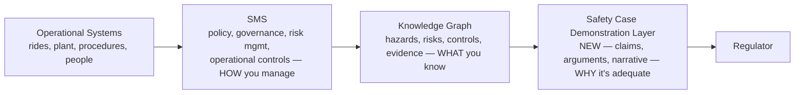
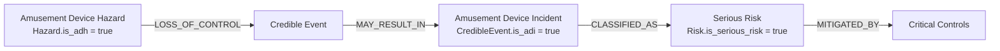

# Safety Case Demonstration Model
**Status: DRAFT — controlled design document. Requires approval before implementation.**
**Parent:** [01-enterprise-knowledge-graph-specification.md](01-enterprise-knowledge-graph-specification.md), [PLATFORM_ARCHITECTURE_V2.md](../PLATFORM_ARCHITECTURE_V2.md)
**Amends:** [02](02-neo4j-node-relationship-model.md), [03](03-postgresql-schema.sql), [06](06-relationship-rules-catalogue.md), [07](07-inference-rules-catalogue.md), [08](08-critical-control-assurance-model.md), [09](09-regulatory-knowledge-model.md), [10](10-openapi.yaml)

---

## 0. Sourcing Status

**Update (2026-08-03):** the actual Guide is now verified directly — you provided the source PDF (`D:\OneDrive - Village Roadshow Limited\06_IOS_ASNZS_Standards\WHS Reg 2011\Guide for major amusement parks Safety Case 2021.pdf`), read in full text across §7–11 (pages 8–46 of 53) plus partial coverage of §8 (MAP/device description) and the licensing-assessment sections. What follows is corrected against that direct reading, not the earlier secondhand review. Where the original review's framing was right but a specific term, section number, or example was off, this document says so explicitly rather than quietly fixing it — the corrections themselves are informative (e.g. FARSI's fifth letter, the EIA vs. 3-gate distinction in [08-critical-control-assurance-model.md](08-critical-control-assurance-model.md)).

**Update (2026-08-04):** §10.8 (Training and competency), §10.9 (Asset integrity), and §12 (Emergency plans, all sub-sections 12.1–12.4) are now read in full — see [09-regulatory-knowledge-model.md](09-regulatory-knowledge-model.md) §5/§5a and [implementation-blueprint/14-architecture-change-requests.md](../implementation-blueprint/14-architecture-change-requests.md) §3a/§4a for the resulting verification findings. **Architecture Review Board decision, 2026-08-04:** ACR-001 (Training) rejected, ACR-002 (Emergency Planning) approved, ACR-003 (Competency Management) approved — Design Baseline is now **v1.1**. Schema, Neo4j model, relationship/inference catalogues, and OpenAPI have been regenerated accordingly ([14-architecture-change-requests.md](../implementation-blueprint/14-architecture-change-requests.md) §6).

**Still not read this session:** §8.1–8.2 (MAP/operator identification), §10.6–10.7 (contractor management, incident management — content referenced in [09-regulatory-knowledge-model.md](09-regulatory-knowledge-model.md) §5 only by section title, not full text), appendices, and the companion *Guide for Developing Major Amusement Parks Safety Case Outline* (also provided, not yet read). Remaining `TO_BE_CONFIRMED` markers below are specifically about those unread portions — not a blanket caveat over the whole document anymore.

**Not yet verified:** the *ICMM Critical Control Management — Practical Guide* PDF you also provided has not been cross-checked against `CRITICAL_RISK_MANAGEMENT_BRIEFING.md`'s existing ICMM citations (architecture doc, [08](08-critical-control-assurance-model.md) §3). Recommend a follow-up pass.

## 1. The Core Correction: SMS ≠ Safety Case

Prior documents in this set ([01](01-enterprise-knowledge-graph-specification.md), architecture doc) treated "SMS content" and "Safety Case content" as flowing through the same pipeline into the same claim structure. Your review is right that this conflates two different outputs of the same underlying knowledge:



The SMS is the system of management. The Knowledge Graph is the system of record for what that management has produced. The **Safety Case Demonstration Layer is new** — it is the thing that takes graph facts and turns them into the regulator's actual unit of assessment: a demonstrated argument, not a queryable database. This section is the architectural correction; §3–§8 are what populate it.

## 2. Device Boundary (first-class entity)

Every `Hazard` in the existing model ([02-neo4j-node-relationship-model.md](02-neo4j-node-relationship-model.md) §3.1) links to an `Asset` — but nothing today formally scopes *what is and isn't part of the device* for Chapter 9A purposes. **Confirmed directly from the Guide, §7.4 "What is an amusement device?" (not paraphrase):**

> "Where is the boundary for each amusement device that aligns with the definition of an 'amusement device'? What is included that involves workers' and patrons' pathways, entries and exits when thinking about users travelling, or moving, on or around the equipment? ... you may wish to consider whether the perimeter fencing or surrounding access paths form part of the amusement device."

The device definition itself is WHS Regulation **Schedule 19 (Dictionary)** (§7.4, quoted in [09-regulatory-knowledge-model.md](09-regulatory-knowledge-model.md) §3 — Schedule 19 confirmed as the Dictionary schedule, not device-specific; no "Schedule 19C" exists), and the Guide is explicit that boundary scope **varies per device** and must be individually documented — not a fixed taxonomy applied uniformly. My original `Interface.interface_type` enum below (`worker_interaction`, `patron_interaction`, etc.) is a reasonable operationalization of the Guide's own examples (pathways, entries/exits, fencing, access paths) for query-ability — **it is not a verbatim regulatory list**, and should be treated as a starting vocabulary the ontology curator refines, not a fixed regulatory requirement.

| Entity | Key fields | Notes |
|---|---|---|
| `DeviceBoundary` | `id`, `asset_id` (→ `Asset`, specifically an amusement device), `boundary_description`, `includes_description`, `excludes_description` | One per amusement device. `Asset` gains an `is_amusement_device` flag rather than a parallel entity — an amusement device is a specialized `Asset`, not a different kind of thing |
| `Interface` | `id`, `boundary_id`, `interface_type` (→ *Interface Taxonomy — operationalized from Guide §7.4 examples, not verbatim regulatory text*), `description` | Captures the Guide's boundary considerations (pathways, entries/exits, fencing, access paths) as a queryable, typed list |

```sql
-- addendum to 03-postgresql-schema.sql
ALTER TABLE safety.assets ADD COLUMN is_amusement_device boolean NOT NULL DEFAULT false;
-- device description fields required by the Guide §8.3 (confirmed, not inferred):
ALTER TABLE safety.assets ADD COLUMN manufacturer varchar(200);
ALTER TABLE safety.assets ADD COLUMN as3533_device_class varchar(50);   -- AS/NZS 3533.1-2009 cl.2.1
ALTER TABLE safety.assets ADD COLUMN plant_design_registration_number varchar(100);
ALTER TABLE safety.assets ADD COLUMN year_manufactured_or_commissioned integer;
ALTER TABLE safety.assets ADD COLUMN previous_names text[];
ALTER TABLE safety.assets ADD COLUMN modification_history text;

CREATE TABLE safety.device_boundaries (
  id                    uuid PRIMARY KEY DEFAULT gen_random_uuid(),
  asset_id              uuid NOT NULL REFERENCES safety.assets(id),
  boundary_description  text NOT NULL,
  includes_description  text,
  excludes_description  text,
  created_at            timestamptz NOT NULL DEFAULT now(),
  updated_at            timestamptz NOT NULL DEFAULT now()
);
CREATE TRIGGER trg_boundaries_updated BEFORE UPDATE ON safety.device_boundaries
  FOR EACH ROW EXECUTE FUNCTION set_updated_at();

CREATE TABLE safety.interfaces (
  id               uuid PRIMARY KEY DEFAULT gen_random_uuid(),
  boundary_id      uuid NOT NULL REFERENCES safety.device_boundaries(id),
  interface_type   varchar(30) NOT NULL CHECK (interface_type IN
                    ('external_hazard','internal_hazard','worker_interaction',
                     'patron_interaction','supporting_system','utility','environment')),
  description      text NOT NULL
);

ALTER TABLE safety.hazards ADD COLUMN is_adh boolean NOT NULL DEFAULT false;
ALTER TABLE safety.hazards ADD COLUMN device_boundary_id uuid REFERENCES safety.device_boundaries(id);
```

The `manufacturer`/`as3533_device_class`/`plant_design_registration_number`/`year_manufactured_or_commissioned`/`previous_names`/`modification_history` fields above are **confirmed required content** (Guide §8.3 "Description of amusement devices") — this is not speculative schema design, it's transcribing a stated requirement.

**Rule (new, feeds [07-inference-rules-catalogue.md](07-inference-rules-catalogue.md) R14):** a `Hazard` classified `is_adh = true` should reference the `DeviceBoundary` its exposure pathway crosses — a boundary-less ADH is a gap finding. Confirmed directly by the Guide: *"The scope of the amusement device boundary will affect the number of ADHs, their location and ADIs that are identified... Hazards which can enter or exit the boundary and cause an ADI must be considered in the safety assessment."*

## 3. The ADH → ADI Pathway

The existing chain `Hazard -[GIVES_RISE_TO]-> Risk` is generic — correct for the general WHS risk model, but it collapses the specific mechanism Chapter 9A's language is built around. This is not a replacement of that chain; it's a **specialization that activates when a hazard is device-related**:



| Entity | Key fields | Relation to existing model |
|---|---|---|
| `Hazard.is_adh` | boolean | New column, not a new table — an ADH is a `Hazard` with this flag set, classified via the Hazard taxonomy scheme (§3 ontology architecture) |
| `CredibleEvent` | `id`, `hazard_id`, `description`, `loss_of_control_description`, `is_adi` (bool) | **New node, inserted between `Hazard` and `Risk`.** For ADH-classified hazards, `Hazard -[LOSS_OF_CONTROL]-> CredibleEvent -[GIVES_RISE_TO]-> Risk` replaces the direct `Hazard -[GIVES_RISE_TO]-> Risk` edge; non-device hazards keep the direct edge unchanged. This is exactly the "additional layer" your review identifies, scoped to where Chapter 9A actually requires it rather than applied everywhere |
| `Risk.is_serious_risk` | boolean + `serious_risk_justification` text | New columns on the existing `Risk` table — mirrors the existing `flag_608b` pattern already on `Consequence`, not a new risk-rating system |

**Why `CredibleEvent` and not just relabeling `Risk`:** a `Risk` in the existing model is fundamentally a rating (likelihood × consequence, [07](07-inference-rules-catalogue.md) R1). A credible event is the *scenario* — the loss-of-control mechanism — which a risk rating is then computed *against*. V1's `bowtie-ccm-generator.html` already half-recognized this (its `topEvent` field, folded into `Risk.description` per [02](02-neo4j-node-relationship-model.md) §6) — this formalizes it as its own entity specifically because Chapter 9A's assessment language is organized around the event, not the rating.

## 4. Safety Assessment (owning entity)

```sql
-- addendum to 03-postgresql-schema.sql
CREATE TABLE safety.safety_assessments (
  id                          uuid PRIMARY KEY DEFAULT gen_random_uuid(),
  device_boundary_id          uuid NOT NULL REFERENCES safety.device_boundaries(id),
  scope_description           text NOT NULL,
  serious_risk_threshold_note text,   -- operator's own documented interpretation — see note below, this is correct as designed, not a gap
  unmitigated_risk_method     text,   -- Guide §9 point 1 — worst-case consequence, considered first, regardless of likelihood
  status                      varchar(20) NOT NULL DEFAULT 'draft',
  prepared_by_person_id       uuid REFERENCES safety.persons(id),
  assessment_date             date,
  created_at                  timestamptz NOT NULL DEFAULT now(),
  updated_at                  timestamptz NOT NULL DEFAULT now()
);
CREATE TABLE safety.safety_assessment_hazards (       -- COVERS
  safety_assessment_id uuid NOT NULL REFERENCES safety.safety_assessments(id),
  hazard_id             uuid NOT NULL REFERENCES safety.hazards(id),
  PRIMARY KEY (safety_assessment_id, hazard_id)
);
```

A `SafetyAssessment` doesn't duplicate the hazard/credible-event/critical-control data — it **aggregates and scopes** it (per your point 7: "these concepts appear to be distributed"; this entity is the thing that un-distributes them for a given device). It is what a `Demonstration` (§7) is generated *from*.

**On `serious_risk_threshold_note`:** confirmed directly from the Guide §7.5 that "serious risk" is **deliberately not** given a fixed numeric threshold by the Regulation — the operator must define and document their own interpretation (Table 1's serious/minor consequence examples are illustrative, not exhaustive), and the regulator assesses the *reasonableness* of that interpretation, not conformance to a fixed number. So this field genuinely is the right shape (operator-authored justification text, not a hardcoded threshold constant) — worth stating plainly since an earlier draft marked it `TO_BE_CONFIRMED` as if it were a missing fact rather than a correctly-modeled judgement call.

## 5. Claim → Argument → Evidence

The existing `SafetyCaseClaim -[SUPPORTS]<- Evidence` edge ([06-relationship-rules-catalogue.md](06-relationship-rules-catalogue.md) §3) lets evidence attach directly to a claim with no stated reasoning — exactly your point 6 observation. This is structurally the same problem the Guide's "referencing procedures is insufficient" language describes: an evidence link is not an explanation.

**Grounding:** Claim → Argument → Evidence is the standard structure of **Goal Structuring Notation (GSN)**, the established method for structured safety argumentation in safety-critical engineering (used across rail, aviation, nuclear, and process safety case practice) — Claim = GSN Goal, Argument = GSN Strategy, Evidence = GSN Solution. Adopting it here isn't inventing new methodology; it's applying an existing, recognized one to close the exact gap your review identifies.

```sql
CREATE TABLE safety.safety_arguments (
  id                    uuid PRIMARY KEY DEFAULT gen_random_uuid(),
  claim_id              uuid NOT NULL REFERENCES safety.safety_case_claims(id),
  argument_text         text NOT NULL,   -- the reasoning connecting evidence to the claim — human-authored or AI-drafted + human-approved, never auto-published (04-ai-extraction-specification.md §6 critical-item override applies)
  sequence              integer NOT NULL DEFAULT 1,
  created_at            timestamptz NOT NULL DEFAULT now()
);
CREATE TABLE safety.safety_argument_evidence (   -- GROUNDED_IN
  argument_id  uuid NOT NULL REFERENCES safety.safety_arguments(id),
  evidence_id  uuid NOT NULL REFERENCES safety.evidence(id),
  PRIMARY KEY (argument_id, evidence_id)
);
```

`SafetyCaseClaim -[SUPPORTED_BY]-> SafetyArgument -[GROUNDED_IN]-> Evidence` supplements (does not remove) the existing direct `SUPPORTS` edge — the direct edge remains useful for the chain-consistency check ([06](06-relationship-rules-catalogue.md) §3), while `SafetyArgument` is where the prose reasoning a regulator actually reads lives.

## 6. Assurance Chain Refinement

Existing: `VerificationActivity -[PRODUCES]-> Evidence`. Your point 8 is specifically about **time** — a point-in-time verification record doesn't show a control stays effective. Inserting a monitoring layer:

```sql
CREATE TABLE safety.monitoring_summaries (
  id                   uuid PRIMARY KEY DEFAULT gen_random_uuid(),
  critical_control_id  uuid NOT NULL REFERENCES safety.critical_controls(control_id),
  period_start         date NOT NULL,
  period_end           date NOT NULL,
  verification_count   integer NOT NULL DEFAULT 0,
  pass_count           integer NOT NULL DEFAULT 0,
  trend                varchar(20) CHECK (trend IN ('improving','stable','declining')),
  summary_text         text,
  generated_at         timestamptz NOT NULL DEFAULT now()
);
```

`Verification -[PRODUCES]-> Evidence`, aggregated over time into `MonitoringSummary` (new [07-inference-rules-catalogue.md](07-inference-rules-catalogue.md) R15, scheduled), feeding the existing three-lines-of-assurance model ([08-critical-control-assurance-model.md](08-critical-control-assurance-model.md) §5, unchanged), which in turn is what a `Demonstration` (§7) cites as its "how do you know this stays effective" evidence. This is additive to [08](08-critical-control-assurance-model.md), not a replacement — the 3-gate test, critical control test, and FARSI scoring in that document are untouched.

## 7. The Safety Case Demonstration Engine

The new top-level module your review recommends. Its job: given a scope (a `SafetyAssessment`, a specific ADH, a critical control, a device), traverse the graph and produce a **structured narrative demonstration**, not a data dump.

### 7.1 Demonstration Entity

```sql
CREATE TABLE safety.demonstrations (
  id                    uuid PRIMARY KEY DEFAULT gen_random_uuid(),
  demonstration_type    varchar(40) NOT NULL CHECK (demonstration_type IN
                         ('control_adequacy','hazard_to_assurance_chain','moc_effectiveness',
                          'governance_effectiveness','verification_confidence','evidence_support')),
  scope_entity_type     varchar(50) NOT NULL,   -- 'safety_assessment' | 'hazard' | 'critical_control' | 'asset'
  scope_entity_id       uuid NOT NULL,
  generated_narrative   text NOT NULL,          -- LLM-authored, citation-grounded (§7.3)
  source_fact_refs      jsonb NOT NULL,         -- every graph node/edge cited, for traceability of the narrative itself
  status                varchar(20) NOT NULL DEFAULT 'draft' CHECK (status IN ('draft','reviewed','approved','published')),
  generated_at          timestamptz NOT NULL DEFAULT now(),
  reviewed_by_person_id uuid REFERENCES safety.persons(id)
);
```

### 7.2 Example Outputs (from your brief, mapped to what generates them)

| Demonstration | Graph traversal it's built from |
|---|---|
| "Demonstrate how ADH-023 is controlled SFAIRP" | `Hazard(ADH-023)` → `CredibleEvent` → `Risk` → `MITIGATED_BY` → `Control`/`CriticalControl` → `PerformanceStandard` → SFAIRP justification text. Term confirmed: **SFAIRP**, not SFARP, for anything ADI/Chapter-9A-facing ([09-regulatory-knowledge-model.md](09-regulatory-knowledge-model.md) §3) |
| "Demonstrate the complete chain from hazard to assurance for Ride X" | Full EKG spec Q1/Q5 pattern, scoped to `Asset = Ride X`. Guide's own Table 4 ("Linking ADHs with ADIs and specific controls" — columns: ADH \| ADI \| example control(s) \| sufficient/not sufficient \| comment) is a **directly confirmed template** for this demonstration type — the Demonstration Engine's control-adequacy narrative should render as this exact table shape, since it's the format the Guide itself uses to demonstrate the logical link it requires |
| "Demonstrate how management of change maintains control effectiveness" | **Confirmed as a real, extensively specified requirement (Guide §10.5, §10.12) — not a gap.** See §7.2a below for the `ManagementOfChange`/`ReviewTrigger` entities this requires |
| "Demonstrate why the identified controls are adequate" | `Control` → EIA test result ([08](08-critical-control-assurance-model.md) §4a) + `CriticalControl` → FARSI score + hierarchy → `SafetyArgument` reasoning text |
| "Demonstrate how governance ensures ongoing effectiveness" | Three lines of assurance ([08](08-critical-control-assurance-model.md) §5, Schedule 18C(7)/(8)) + `MonitoringSummary` trend (leading/lagging, [08](08-critical-control-assurance-model.md) §5.1) |
| "Demonstrate how verification provides confidence" | `VerificationActivity` history + `MonitoringSummary` |
| "Demonstrate how evidence supports each claim" | `SafetyArgument` → `GROUNDED_IN` → `Evidence`, per claim |

### 7.2a Management of Change (confirmed, formalized)

The Guide's own anti-pattern example (§0 above) is specifically about MoC — *"we manage all changes... as described in the MOC procedure document number 124.02"* is explicitly called insufficient. §10.5 and §10.12 together give real structure to formalize:

```sql
CREATE TABLE safety.management_of_change (
  id                          uuid PRIMARY KEY DEFAULT gen_random_uuid(),
  asset_id                    uuid REFERENCES safety.assets(id),
  change_description          text NOT NULL,
  change_type                 varchar(10) NOT NULL CHECK (change_type IN ('minor','major')),  -- Guide's own examples: minor = sign colour change; major = roller coaster component replacement
  change_category             varchar(30) CHECK (change_category IN
                               ('amusement_device','plant_or_structure','operation_or_nature_of_operation',
                                'worker_safety_role','training','maintenance_or_inspection',
                                'annual_or_major_inspection','organisational')),
  risk_reassessment_required  boolean NOT NULL DEFAULT true,
  linked_safety_assessment_id uuid REFERENCES safety.safety_assessments(id),
  requested_by_person_id      uuid REFERENCES safety.persons(id),
  approved_by_person_id       uuid REFERENCES safety.persons(id),
  status                      varchar(20) NOT NULL DEFAULT 'proposed' CHECK (status IN ('proposed','under_review','approved','implemented','closed')),
  created_at                  timestamptz NOT NULL DEFAULT now(),
  updated_at                  timestamptz NOT NULL DEFAULT now()
);

CREATE TABLE safety.review_triggers (
  id                    uuid PRIMARY KEY DEFAULT gen_random_uuid(),
  trigger_type          varchar(30) NOT NULL CHECK (trigger_type IN
                        ('control_not_controlling_risk','new_adh_identified',
                         'worker_consultation_flagged','regulator_requested','moc_change')),
  moc_id                uuid REFERENCES safety.management_of_change(id),
  description            text NOT NULL,
  requires_update_of     text[] NOT NULL,   -- subset of {'safety_assessment','emergency_plan','sms','safety_case'}
  status                 varchar(20) NOT NULL DEFAULT 'open' CHECK (status IN ('open','actioned','closed')),
  created_at              timestamptz NOT NULL DEFAULT now()
);
```

`change_type`/`change_category` values and the `ReviewTrigger.trigger_type` circumstance values (`control_not_controlling_risk`, `new_adh_identified`, `worker_consultation_flagged`, `regulator_requested`) are **transcribed directly** from the Guide's own §10.12 list, not invented. A `management_of_change` "demonstration" is a `Demonstration` whose narrative must, per the Guide's own anti-pattern warning, explain **what a change is, its stages, approval process, and how it links to performance standards and monitoring** — not just assert that a MOC procedure document exists.

### 7.3 Generation Approach

Not free-form LLM generation — a **template + graph-traversal + constrained-narration** pipeline, extending [04-ai-extraction-specification.md](04-ai-extraction-specification.md)'s pattern rather than inventing a new one:

1. Given a `demonstration_type` + scope, run the corresponding named graph query (extends EKG spec §5's pattern catalogue — e.g. a new `Q8_control_adequacy_demonstration`).
2. Assemble the retrieved facts (hazard, credible event, controls, performance standards, verification/monitoring history, existing `SafetyArgument` text) into a structured context.
3. LLM narrates **only** from the assembled facts, with every claim in the narrative required to cite a `source_fact_refs` entry — no fact in the narrative may lack a graph citation. This is the same discipline as extraction source-span citation ([04](04-ai-extraction-specification.md) §5), applied in the output direction instead of the input direction.
4. `status = 'draft'` on generation, always. A `Demonstration` **never** auto-advances to `approved`/`published` — matches every other critical-item override in this document set ([04](04-ai-extraction-specification.md) §6, [09](09-regulatory-knowledge-model.md) §4).
5. New inference rule ([07-inference-rules-catalogue.md](07-inference-rules-catalogue.md) R16): a published `Demonstration` whose underlying facts have since changed (any cited entity updated after `generated_at`) is flagged stale, not silently left looking current.

### 7.4 What This Does *Not* Do

It does not replace the `SafetyCaseClaim`/`SafetyArgument` structures in §5 — a `Demonstration` is a generated *presentation* of that underlying structured argument, assembled for a specific regulator-facing purpose (a device, a hazard, an audit response). The structured Claim/Argument/Evidence graph is the durable asset; `Demonstration` rows are its renderings, regenerable at will, never the source of truth.

## 8. Summary of New Entities (cross-reference)

| Entity | Added to schema (§) | Added to Neo4j model | New relationships |
|---|---|---|---|
| `DeviceBoundary`, `Interface` | §2 | [02](02-neo4j-node-relationship-model.md) | `HAS_BOUNDARY`, `HAS_INTERFACE` |
| `CredibleEvent`, `Hazard.is_adh`, `Risk.is_serious_risk` | §3 | [02](02-neo4j-node-relationship-model.md) | `LOSS_OF_CONTROL`, redirected `GIVES_RISE_TO` |
| `SafetyAssessment` | §4 | [02](02-neo4j-node-relationship-model.md) | `ASSESSES`, `COVERS` |
| `SafetyArgument` | §5 | [02](02-neo4j-node-relationship-model.md) | `SUPPORTED_BY`, `GROUNDED_IN` |
| `MonitoringSummary` | §6 | [02](02-neo4j-node-relationship-model.md) | `SUMMARIZES` |
| `Demonstration` | §7.1 | [02](02-neo4j-node-relationship-model.md) | `DEMONSTRATES` |
| `ManagementOfChange`, `ReviewTrigger` | §7.2a | [02](02-neo4j-node-relationship-model.md) | `PROPOSES_CHANGE_TO`, `TRIGGERS_REVIEW_OF` |
| `Asset.manufacturer`, `.as3533_device_class`, `.plant_design_registration_number`, `.year_manufactured_or_commissioned`, `.previous_names`, `.modification_history` | §2 | — (properties on existing `Asset` node) | — |

Full DDL, Cypher, relationship catalogue entries, and inference rules for all of the above are applied directly to documents 02/03/06/07/08/09/10 rather than duplicated here — this document is the rationale and model; those remain the single source of truth for schema/graph/API detail.

## 9. Terminology — Resolved

**SFAIRP**, confirmed (not SFARP), for every Chapter 9A/ADI/MAP-facing field, label, and generated Demonstration — see [09-regulatory-knowledge-model.md](09-regulatory-knowledge-model.md) §3 for the full resolution and what does/doesn't carry over to the general (non-MAP) `Risk.sfarp_justification` field inherited from V1.
